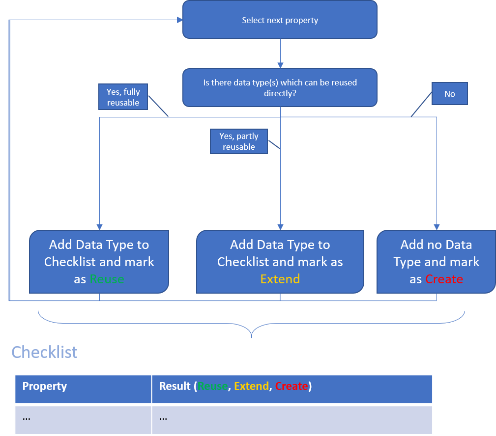

## 2.2 DTR Inquiry

What we have to do now is to check for every property in the hierarchy, whether we can find an appropriate Data Type in the DTR. Therefor, we collect all properties in a checklist:

| Property            | DTR Inquiry Result (Reuse, Extend, Create) |
| ------------------- | ------------------------------------------------------------ |
| id                  |                                                              |
| pid                 |                                                              |
| relatedResource     |                                                              |
| createdAt           |                                                              |
| lastUpdate          |                                                              |
| schemaId            |                                                              |
| recordVersion       |                                                              |
| metadataDocumentUri |                                                              |
| documentHash        |                                                              |
| aclList             |                                                              |

Now, we go through each element in the checklist and apply the following process filling the checklist successively:

As a result, the previously prepared checklist looks as follows:

| Property            | DTR Inquiry Result (Reuse, Extend, Create) |
| ------------------- | ------------------------------------------------------------ |
| id                  | Reuse **unicode-line-string** (21.T11148/f1627ce85386d8d75078) |
| pid                 | Reuse **identifier-general** (21.T11148/38330bcc6a40ca85e5b4) |
| relatedResource     | Reuse **URL** (21.T11148/e0efc41346cda4ba84ca)               |
| createdAt           | Reuse **date-time-rfc3339** (21.T11148/3bfb2839a6967114bc3e) |
| lastUpdate          | Reuse **date-time-rfc3339** (21.T11148/3bfb2839a6967114bc3e) |
| schemaId            | Reuse **unicode-line-string** (21.T11148/f1627ce85386d8d75078) |
| recordVersion       | Reuse **non_negative_integer** (21.T11148/eca44a2ac007d5e126f5) |
| metadataDocumentUri | Reuse **URL** (21.T11148/e0efc41346cda4ba84ca)               |
| documentHash        | Reuse **sha-checksum** (21.T11148/66bf538937bf74bfc48a)      |
| aclList             | Create                                                       |

> It's highly recommended to note the PIDs of the identified Data Types, as we'll need them later. 

Almost done, only `aclList` is still open. As this property is another complex type, we have to create another checklist filling it the same way as we just did: 

| Property   | DTR Inquiry Result (Reuse, Extend, Create) |
| ---------- | ------------------------------------------------------------ |
| sid        | Reuse **unicode-line-string** (21.T11148/f1627ce85386d8d75078) |
| permission | Create                                                       |

