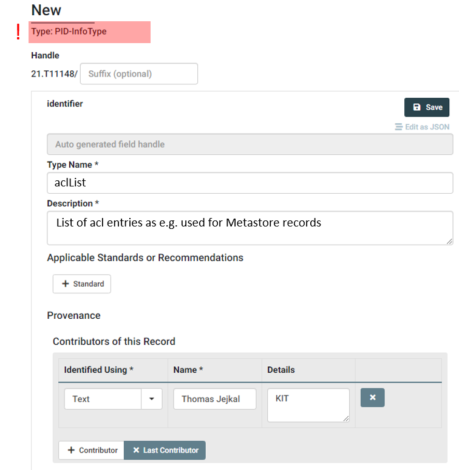
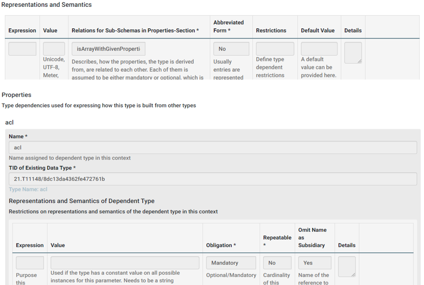
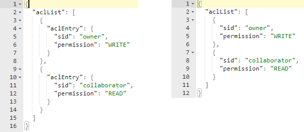

## 3.2 Register extended Child-Data Type(s)

After registering elements of the lower hierarchy, e.g., `permission` and `aclEntry` we now proceed with the next higher level, namely the `aclList` Data Type. We start as before with creating a new Data Type of type *PID-InfoType*.

We add a Type name as well as the Contributor information as for all other Data Types. The following steps are slightly different, as you can see in the following screenshot.

First, in the *Represenatations and Semantics* section we add the value `isArrayWithGivenProperties` under *Relations for Sub-Schemas in Properties-Section*. This states, that the properties defined later will form an array representation in the resulting type, which is what we want for the `aclList`. Afterwards, we add one property, which has the Data Type of an *aclEntry* we've just defined. Note here, that the Data Type Name must not match the actual name of the used Data Type, which was *aclEntry* but can be freely chosen. However, for the Existing Data Type we use the PID of the *aclEntry*. In our example, we set the *Obligation* to *Mandatory* and do not allow multiple entries of *aclList* by setting *Repeatable* to *No*. Furthermore, we set *Omit Name as Subsidiary* to *Yes*. Please see to following example to understand the reason behind.

On the left side you see an *aclList* without omitting the name of subsidiaries. You can see *aclEntry* appearing on each child element. On the right side you see what omitting of subsidiary names does and as this is the commonly used representation of array elements, we omit the name *aclEntry* by setting the property. That's it, we defined our *aclList* Data Type and we can save it. In our case, the resulting PID is *21.T11148/8b7b3f1b796a4dc1030f* which we can now add to our main checklist.

| Property            | DTR Inquiry Result (Reuse, Extend, Create) |
| ------------------- | ------------------------------------------------------------ |
| id                  | Reuse **unicode-line-string** (21.T11148/f1627ce85386d8d75078) |
| pid                 | Reuse **identifier-general** (21.T11148/38330bcc6a40ca85e5b4) |
| relatedResource     | Reuse **URL** (21.T11148/e0efc41346cda4ba84ca) |
| createdAt           | Reuse **date-time-rfc3339** (21.T11148/3bfb2839a6967114bc3e) |
| lastUpdate          | Reuse **date-time-rfc3339** (21.T11148/3bfb2839a6967114bc3e) |
| schemaId            | Reuse **unicode-line-string** (21.T11148/f1627ce85386d8d75078) |
| recordVersion       | Reuse **non_negative_integer** (21.T11148/eca44a2ac007d5e126f5) |
| metadataDocumentUri | Reuse **URL** (21.T11148/e0efc41346cda4ba84ca) |
| documentHash        | Reuse **sha-checksum** (21.T11148/66bf538937bf74bfc48a) |
| aclList             | Create **aclList** (21.T11148/8b7b3f1b796a4dc1030f) |

The checklist on the top hierarchy level is now complete and we can define our final Data Type representing our envisioned structure.

