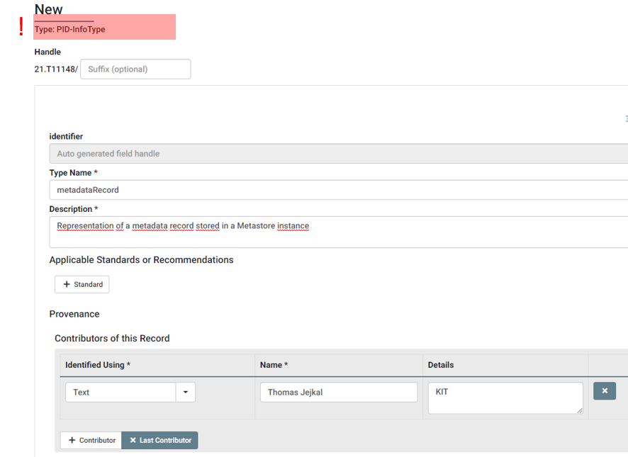

## 3.3 Register main Data Type

Finally, we arrived at the step where we collected everything in order to create our main Data Type. All these information are collected in our checklist, which we use now for defining this Data Type.

| Property            | DTR Inquiry Result (Reuse, Extend, Create) |
| ------------------- | ------------------------------------------------------------ |
| id                  | Reuse **unicode-line-string** (21.T11148/f1627ce85386d8d75078) |
| pid                 | Reuse **identifier-general** (21.T11148/38330bcc6a40ca85e5b4) |
| relatedResource     | Reuse **URL** (21.T11148/e0efc41346cda4ba84ca) |
| createdAt           | Reuse **date-time-rfc3339** (21.T11148/3bfb2839a6967114bc3e) |
| lastUpdate          | Reuse **date-time-rfc3339** (21.T11148/3bfb2839a6967114bc3e) |
| schemaId            | Reuse **unicode-line-string** (21.T11148/f1627ce85386d8d75078) |
| recordVersion       | Reuse **non_negative_integer** (21.T11148/eca44a2ac007d5e126f5) |
| metadataDocumentUri | Reuse **URL** (21.T11148/e0efc41346cda4ba84ca) |
| documentHash        | Reuse **sha-checksum** (21.T11148/66bf538937bf74bfc48a) |
| aclList             | Create **aclList** (21.T11148/8b7b3f1b796a4dc1030f) |

At first, we create a new Data Type of Type *PID-InfoType*.

As before, we assign a *Type Name*, maybe a short *Description* and *Contributor* information. Afterwards, we add properties for each entry in our checklist assigning a *Data Type Name*, e.g., the value in the Property column of our checklist, and the *TID of Existing Data Type*, which is the *PID* value in the DTR Inquiry Result column. The *Obligation* we may or may not set to *Mandatory*, the *Repeatable* value should be set to *No* as each attribute of our structure can also appear once and *Omit Names as Subsidiary* should also stay *No* in that case, as we need to map the single values to the according properties by name. After transferring all properties we can save the *metadataRecord* Data Type and receive a new PID with value *21.T11148/6a29026053036431de11*. 

This PID now represents exactly the structure shown at the beginning:

We are finished now with this receipt. If you like, you can check the next page for possible applications of the defined Data Type.