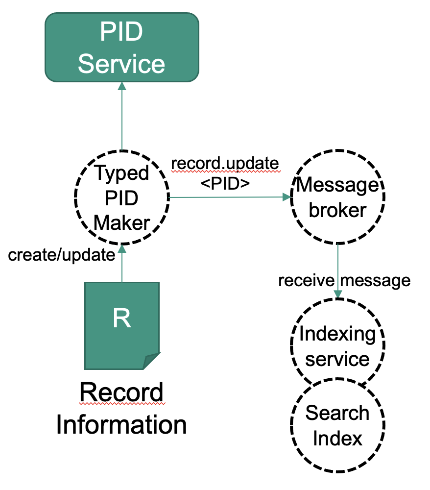

# Search PIDs using record information

To search within PIDs, you need a search index. This recipe is about how such an index can be created and used. This approach generally works using the [messaging approach to notify other services](./notify.md), in this case an indexer service. This approach scales well and supports federation, which enables not only to build up one large search index, but also specialized niche indices easily.

This approach is implemented in the [testbed](../appendix/appendix_testbed.md), but there currently only supports the indexing of PIDs which will be announced via [message brokers](./notify.md). This means that in the testbed, only PIDs which get created or updated after the search functionality was set up are indexed (change notifications). To also retrieve older PIDs which are not changing, ecosystems must offer further approaches, like regular "record.refresh" messages, indicating non-changing PIDs regularly or similar.

---

## Ingredients

- One or more message brokers to subscribe to for PIDs
- A search index like elasticsearch for example
- An indexer service with AMQP support, which can ingest FDOs into the search index

Alternatively, for testing/experimentation purposes, you can use a [testbed](../appendix/appendix_testbed.md) instance, which comes with pre-configured with these ingredients and can be run using docker on your local machine.

---

## Work Steps (Summary)

As soon as the PID information types service is configured to use the message broker, everything happens in the background. These steps show you how to visualize what happens hidden in the background, when using the testbed.

1. Register your indexer at selected message brokers
2. Use the search index to explore the results
3. Use the search index APIs to build your custom search functionality.

---

TODO
